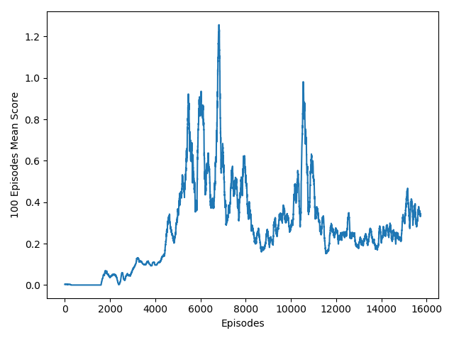
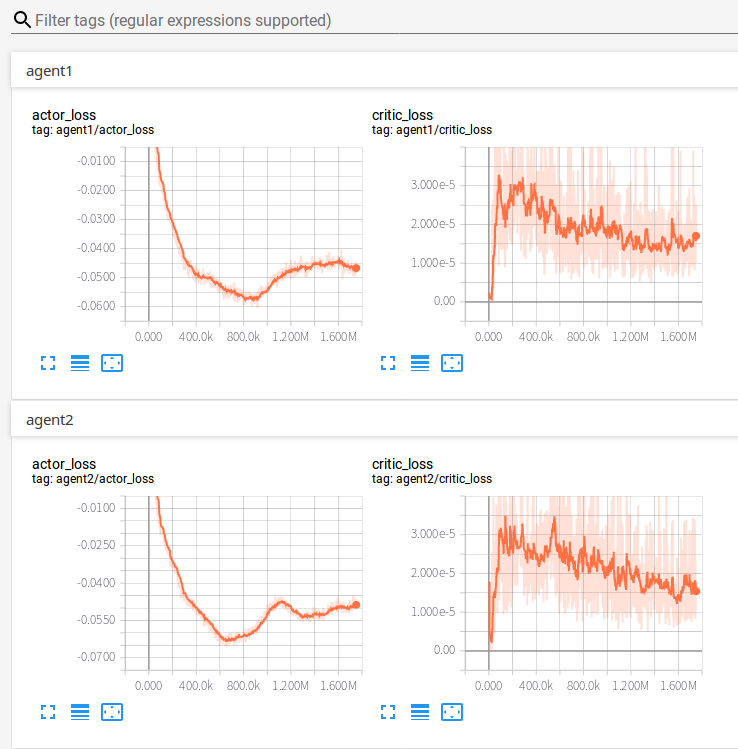

#### Learning Algorithms

**MADDPG**
```
create agent1, agent2
initialize replaybuffer
for i in episodes(1:16000):
    environment restart and generate init state.
    while True:
        act1 = agent1.actor(state[0], train=False)
        act2 = agent2.actor(state[1], train=False)
        next_state, reward, done = env.next([act1, act2])
        if any of the done is True:
            episode end
    if replaybuffer size larger than batch size:
        for agent in [agent1, agent2]:
            sample a batch data from replay buffer
            using the next_state in sampled data to generate the next action of agent1 and agent2, the data is generated by using the agent's target actor.
            using the current state in sampled data to generate the current action of agent1 and agent2 the data is generateed by using the agent's actor.
            generate the critic value from the next_state and next_action.
            critic_target is calculated by add the reward from sampled data and the agent.target_critic([next_state, next_action])
            critic loss is to calculate the mean square error between agent.critic([state, action])
            backward critic loss.
            actro loss is calculated by 0-agent.critic([state, current action])
            backward actor loss.
            soft update the target critic and target agent
```

#### Hyper Parameters

| parameter   |      value | 
|----------|:-------------:|
| discount rate | 0.95     |
| max episodes | 16000    |
| replay buffer min memory size | 4096 |
| replay buffer size  | 5e5 |
| batch-size    |    512    |
| optimizer     |    Adam  |
| actor learning rate |   1e-4   |
| critic learning rate |   1e-3   |
| target_network_mix |   1e-3   |

#### Networks
* Actor Network has three fully connected layers, with hidden layer size (400, 300), (300, 2).
* Critic Network has three fully connected layers, with hidden layer (400, 300), (300, 1).
* The actor network and critic network have a `BatchNorm` layer executed after the first hidden layer.
* The actor network use `relu` as activate function and the final fully connected layer use `tanh` as activate function.
* The critic network use `leaky_relu` as activate function.

#### Results
It takes many episodes to . The following is running detail of PPO with actor-critic.

*  **MADDPG**

    The max agent's episodes reward averaged over 100 episoeds

    

    The actor and critic loss of agent1 and agent2 during training(smooth rate=0.9).

    

    Test Result

    ```
        Tennis Round 0, Total score (averaged over agents) this episode: [0.3  0.29]
        Tennis Round 1, Total score (averaged over agents) this episode: [2.00000003 2.09000003]
        Tennis Round 2, Total score (averaged over agents) this episode: [0.2  0.19]
        Tennis Round 3, Total score (averaged over agents) this episode: [0.60000001 0.59000001]
        Tennis Round 4, Total score (averaged over agents) this episode: [1.20000002 1.19000002]
        Tennis Round 5, Total score (averaged over agents) this episode: [0.2  0.09]
        Tennis Round 6, Total score (averaged over agents) this episode: [0.40000001 0.39000001]
        Tennis Round 7, Total score (averaged over agents) this episode: [ 0.1  -0.01]
        Tennis Round 8, Total score (averaged over agents) this episode: [0.2  0.19]
        Tennis Round 9, Total score (averaged over agents) this episode: [0.2  0.19]

    ```


#### Future Ideas
* To test different hyper parameter combination in order to training fast.
* Try to test multiple agent proximal policy optimize.
* Try to solve some more challenge environment like SC2LE (StarCraft II Learning Environment)
* Implement SAC with automatically adujsted temperature
* Try to read some paper about meta-learning. Using meta-learning method to learn a policy to generate policy.